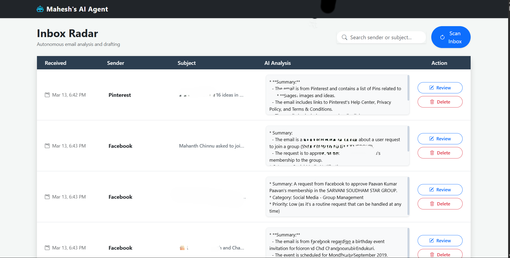
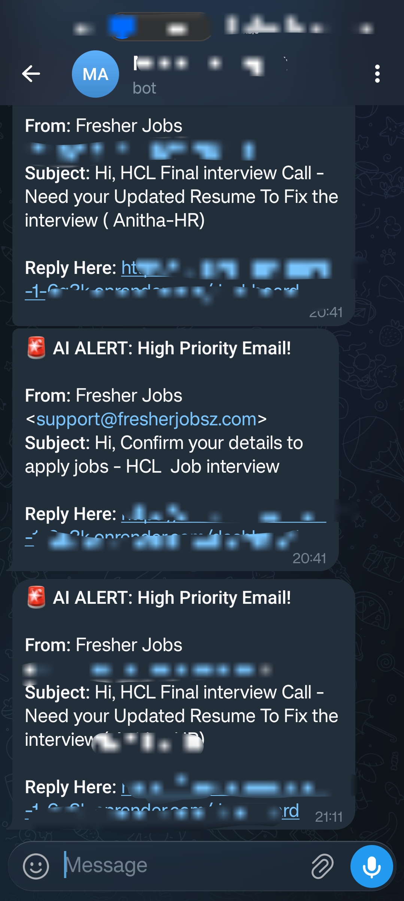

<h1 align="center">🛡️ Project Sentinel: Autonomous AI Email Agent</h1>

  

  
  
  

> 💡 **Repository Status: Public Showcase** > This repo contains the sanitized, production-grade core logic of a live AI assistant. All sensitive credentials have been removed to demonstrate architecture safely.

 

<h2 align="center"> ⚡ The Core Vision ⚡ </h2>

`Project Sentinel` isn't just an email filter; it's a persistent digital aide. This repository showcases the "brain" of the operation: the Java backend that connects to IMAP servers, processes natural language, and determines appropriate actions.

To maintain security and enterprise best practices, this project utilizes a dual-repository strategy:

| 🗄️ Repository Type | 🎯 Purpose | 🔒 Security Posture |
| :--- | :--- | :--- |
| **🌎 Public Showcase (Here)** | Displays architecture, logic, and code quality. | **100% Sanitized.** Placeholder configurations only. |
| **🔐 Private Runner** | The active production environment. | **Private.** Contains live credentials, deployed on Render. |

 

<h2 align="center"> 🧠 System Intelligence & Data Flow 🧠 </h2>

When active, `Project Sentinel` doesn't just read words; it understands context. The pipeline takes an incoming IMAP email packet and routes it through an AI model for deep analysis, classifying if an email needs user intervention, an automated reply, or a quick summary.

  

### 🔬 Core Capabilities
<table>
  <tr>
    <td><b>🔄 Persistent Monitoring</b> Uses a background <code>@Scheduled</code> task in Spring Boot to continuously poll the configured IMAP server.</td>
    <td><b>🤖 LLM Integration</b> Leverages AI via a secure REST API to perform sentiment analysis, intent classification, and summary generation.</td>
  </tr>
  <tr>
    <td colspan="2" align="center"><b>🔐 Credential Security</b> Built 100% on externalized environment variables ensuring zero secrets are hardcoded.</td>
  </tr>
</table>

 

<h2 align="center"> 📡 Telegram Integration: The Live Control Panel 📡 </h2>

A critical part of a background agent is human-in-the-loop control. The live version of `Project Sentinel` communicates with the owner via a secure Telegram Bot interface.

<table>
  <tr>
    <td width="50%">
      <h3>🕹️ Command Flow:</h3>
      <ol>
        <li>The agent identifies an "Urgent" email.</li>
        <li>It pauses execution and pushes a notification via the Telegram API.</li>
        <li>The owner responds with simple commands like <kbd>/approve</kbd> or <kbd>/ignore</kbd>.</li>
        <li>The Spring Boot backend intercepts the webhook and executes the action.</li>
      </ol>
    </td>
    <td width="50%" align="center">
      
    </td>
  </tr>
</table>

 

<h2 align="center"> 💻 Technical Deep Dive 💻 </h2>

  

<b>🛠️ Click to expand full Tech Stack details</b>

 

* **Core:** Java 17 (LTS)
* **Framework:** Spring Boot 3.x
* **Integrations:** Spring Mail / IMAP protocols
* **Build Tool:** Maven 
* **Control Layer:** Telegram Bot API
* **Intelligence Layer:** Groq API / OpenAI 

